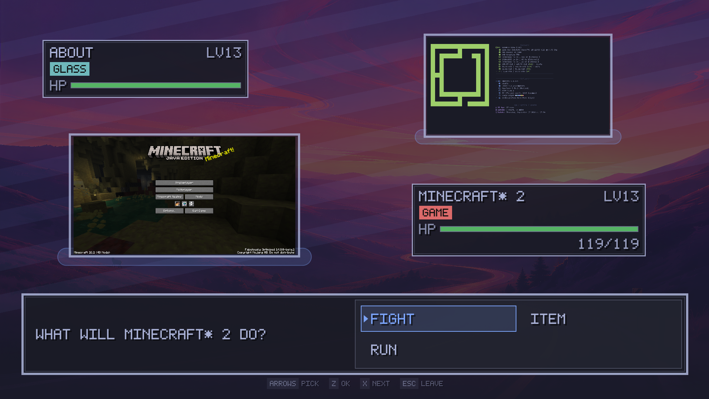

# hyprbattles / Hyprland Pokemon Battles

Swap one window with another and, one time in four - the two of them settle it in a turn-based fight instead
of just handling it like adults.



Inspired by Pokemon: Types, HP bars, a move menu, a `FIGHT`/`ITEM`/`RUN` choice, chiptune - and the
fighters are the windows themselves, still running, captured onto a battle
screen over your own wallpaper.

The winner keeps the cell they were arguing
about.

Creatures eat, too, and the food is your actual machine: free memory, page
cache, swap, entropy, zombie processes. All of it read-only, none of it
consumed, and a ledger so you cannot feed the same 512 MiB to a creature
twice. See [`docs/FOOD.md`](docs/FOOD.md) - open a browser and your creatures
go hungry.

Windows remember. A creature is its window class, so the level your terminal
earned this morning is still its level tomorrow: meals and battles buy
experience, experience buys levels, and at level 12 and 25 it **evolves** -
a new name, better moves, and eight seconds of the overlay saying so. How much
a window can eat is bought with how long it has been open, so an old window
has an appetite and a fresh one does not. See
[`docs/CREATURES.md`](docs/CREATURES.md).

Levels teach it things, too. A creature knows more moves than the four it
carries - its own type's arrive with evolution, the rest are borrowed one at a
time as it levels - and which four it fights with is yours to pick, as long as
two of them stay its own type.

There is a bar icon for all of it: the switch, one card per open window with
what it has won and how hungry it is, each window's own page, the pantry to
feed it from, and - at the bottom - the ones whose windows are shut, which
keep their levels and their moves and wait.

It is a joke that plays straight. The type chart is real, the damage formula
is real, the loser genuinely gets moved. What it cannot do is cost you
anything: no window is ever closed, killed, floated, resized or sent
elsewhere. The worst outcome of a battle is a window ending up one cell from
where you wanted it, which is also the worst outcome of not having a battle.

## What it adds

| Piece | What it is |
| --- | --- |
| [`bin/battles`](bin/battles) | The daemon: moves the window, spots the collision, rolls the odds, borrows the controller, runs the fight. |
| [`bin/battles-ctl`](bin/battles-ctl) | Move a window, read the state, switch battles on or off, or force one, from anywhere. |
| [`lib/window_moves.py`](lib/window_moves.py) | Which command moves a window one cell, per layout, and how to tell a swap from a step into an empty cell. |
| [`lib/battle_rules.py`](lib/battle_rules.py) | The rules: creatures, types, damage, the turn loop. No I/O in it at all. |
| [`lib/pantry.py`](lib/pantry.py) | The food: read-only readings of free memory, cache, swap, entropy, idle cycles and zombies, and the ledger that keeps them honest. |
| [`lib/creatures.py`](lib/creatures.py) | What a window class has earned, what one window has eaten, and how old it is. The only thing here that writes. |
| [`Roster.qml`](Roster.qml) | The bar panel: the switch, the creatures, and the food to feed them. |
| [`Battle.qml`](Battle.qml) | The battle screen. Draws the snapshot the daemon publishes, and nothing else. |
| [`PixelText.qml`](PixelText.qml) | An original 5x7 pixel font, drawn square by square onto a Canvas. |

Full rules, the trigger path, the escape hatches and how to force one:
[`docs/BATTLES.md`](docs/BATTLES.md). The pantry and its ledger:
[`docs/FOOD.md`](docs/FOOD.md). Levels, evolution, hunger and the bar panel:
[`docs/CREATURES.md`](docs/CREATURES.md).

## What it needs

Hyprland and Python 3. That is the list.

**Any layout works.** The plugin makes the move itself and reads the swap back
out of Hyprland's own window list, so dwindle, master and a scrolling layout
all collide the same way - it never has to be told that two windows changed
places. `lib/window_moves.py` is the whole of the difference between them.

Two other plugins are supported. Neither is required, neither is imported or
linked against, and neither is looked for on disk - they are reached through
Hyprland's sockets, so a missing one costs a shortcut rather than raising an
error:

| Plugin | What it adds | Required |
| --- | --- | --- |
| Demon Slayer's Hyprscroll2D | Announces every collision itself, so battles trigger from the move keys that layout already binds, with nothing rebound | no |
| The gamepad plugin | A controller to play with, the narrower pad-only collision event, and a second of both motors as a battle opens (its `docs/PAD-API.md`) | no |

**Demon Slayer's Hyprscroll2D is a private fork of the original Hyprscroll2D,
and it is never going to be published** - it stays between its author and
this one, which is his call and a fair one. So assume you do not have it:
bind a move key to `battles-ctl move` as below and everything on this page
works the same, on whatever layout you already use.

Without the gamepad plugin battles are still fully playable, because the
overlay holds the keyboard regardless.

An audio player (`mpv`, `pw-play`, `paplay` or `aplay`) is optional; without
one, battles are silent.

## Install

```bash
omarchy plugin add <this repository> --enable
omarchy restart shell
```

Then put the move on a key. This is what makes windows collide: it moves the
focused window one cell exactly as the layout underneath it would have, and
rolls for a battle when that move lands on somebody.

```bash
# ~/.config/hypr/bindings.lua, where Hyprland is configured in Lua
local battles = os.getenv("HOME")
  .. "/.config/omarchy/plugins/dev.cstav.omarchy.plugin.hyprbattles/bin/battles-ctl"
for _, d in ipairs({ { "H", "left" }, { "J", "down" }, { "K", "up" }, { "L", "right" } }) do
  o.bind("SUPER + SHIFT + " .. d[1], "Window: Move " .. d[2],
    battles .. " move " .. d[2])
end
```

```ini
# or, in a hyprland.conf
bind = SUPER SHIFT, H, exec, ~/.config/omarchy/plugins/dev.cstav.omarchy.plugin.hyprbattles/bin/battles-ctl move left
```

It replaces whatever move dispatcher was on those keys and keeps doing that
job: the window moves whether battles are switched on or off, whether the roll
comes up or not, and whether or not the daemon is even running - with the
shell down, the command makes the move itself. **On Demon Slayer's
Hyprscroll2D you can skip this entirely**; that layout posts its own
collisions, so its own move keys already trigger battles.

Then add the toggle to `~/.config/omarchy/extensions/omarchy-menu.jsonc`:

```jsonc
"trigger.toggle.window-battles": {"icon":"\udb81\udf87","label":"Window Battles","aliases":["battles","hyprbattles","pokemon"],"when":"test -x $HOME/.config/omarchy/plugins/dev.cstav.omarchy.plugin.hyprbattles/bin/battles-ctl","checked":"[ \"$($HOME/.config/omarchy/plugins/dev.cstav.omarchy.plugin.hyprbattles/bin/battles-ctl enabled)\" = true ]","action":"$HOME/.config/omarchy/plugins/dev.cstav.omarchy.plugin.hyprbattles/bin/battles-ctl toggle"},
```

It lands under **Trigger -> Toggle**, beside the other switches, with a tick
while battles are on.

And put the bar icon on the bar - the switch, the roster and the food all live
behind it:

```bash
omarchy bar put dev.cstav.omarchy.plugin.hyprbattles --section right
```

If that says it is already on the bar without adding it, the id is in
`plugins` but not in the layout; add `{"id": "dev.cstav.omarchy.plugin.hyprbattles"}`
to `bar.layout.right` in `~/.config/omarchy/shell.json` yourself. The icon is
the same crossed swords the menu row carries, grey while battles are off, and
it lights a small red dot only when a creature is one meal from evolving.

## Turning it off

The switch at the top of the bar panel, the menu row, or:

```bash
bin/battles-ctl off        # or on, or toggle
bin/battles-ctl enabled    # true / false
```

Off means no battle can start at all - it is checked before the roll - and a
battle already on screen ends when it is switched off.

The setting is a **file**, `~/.local/state/hyprscroll2d/battles-disabled`
(present means off), not a running process. Reading and flipping it therefore
works with the daemon stopped, which is what lets the menu row answer while
the shell is restarting. The daemon is only nudged afterwards, so that a
battle already on screen can be ended.

## Your own music

Seven generated WAVs ship with it, the looping battle theme included, so a
fresh clone fights with sound. To use something else, drop a file of the same
name into `~/.config/omarchy/hyprbattles/assets/` - outside the checkout,
so a clone stays clean however much music ends up in it:

```bash
bin/battles-ctl assets              # the mode, and which file every sound
                                    # is actually resolving to
bin/battles-ctl assets generated    # ignore your files, for an A/B
bin/battles-ctl assets custom       # play only your files
bin/battles-ctl assets auto         # yours when there is one, else the
                                    # generated one. Per file. The default.
```

`HYPRBATTLES_ASSETS=generated` overrides the saved mode for one run, and
`bin/import-battle-theme <file>` decodes an MP3 into the right place. The whole
story, including what the generated theme is made of, is in
[Sound](docs/BATTLES.md#sound).

## Development

```bash
make check      # tests, byte-compile, plugin validate
make audio      # regenerate the committed chiptune, the theme included
```

The rules are pure functions and a state machine with no I/O in them, so the
type ring, the damage formula, the odds, the run chances, the menus and every
timeout run against fixtures with seeded generators. The daemon's judgement
calls - does this collision become a battle, does the switch stop it, what may
a result do to a window - are tested against a bare instance, without a
compositor. [`tests/battles.py`](tests/battles.py).

Two traps worth knowing:

- **QML does not hot-reload in this shell.** After any `.qml` change, run
  `omarchy restart shell`.
- **This Hyprland is configured in Lua**, and its IPC evaluates
  `hl.dispatch(<what you sent>)`. Classic dispatcher strings are a syntax
  error, and over the socket that error comes back in a reply nobody reads, so
  it looks like nothing happened. Everything this daemon sends is an
  `hl.dsp.*` expression, and a test pins that down.

## Licensing

**Everything shipped here is original and redistributable under the MIT
licence**: the whole soundtrack, the looping battle theme included, is
synthesised note by note by [`bin/make-battle-audio`](bin/make-battle-audio)
out of the standard library's `wave` module - the era and the instruments of a
1980s sound chip are imitated, no tune is - the pixel font is drawn glyph by
glyph in `PixelText.qml`, and the creature names are your own window classes.
No sprites, audio, fonts or names from any commercial game, and no cover of
one, because a cover is still somebody else's composition.

Your own music goes **outside the checkout**, in
`~/.config/omarchy/hyprbattles/assets/`, where nothing you put there can
reach the repository whatever its licence says. See
[Sound](docs/BATTLES.md#sound).

## License

MIT
